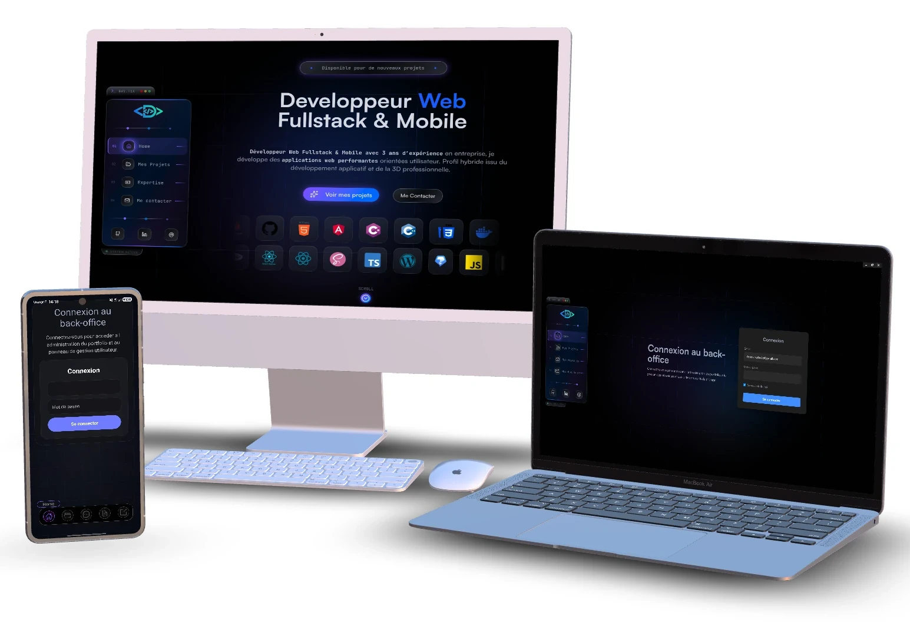

# Portfolio Ecosystem

<p align="center">
  Pièce centrale de mon portfolio : un écosystème fullstack complet réunissant une vitrine publique, une API métier, un back-office desktop et une application mobile autour d'une même base fonctionnelle.
</p>

<p align="center">
  <a href="./LICENSE">
    
  </a>
  
  
  
  
  
  
</p>

<p align="center">
  <a href="https://donovan-dev-web.vercel.app/">Site public</a>
  ·
  <a href="https://donovan-dev-web.vercel.app/api-docs">Documentation API</a>
</p>



## Vue d'ensemble

Ce projet n'a pas été pensé comme un simple portfolio vitrine. L'objectif était de construire un produit complet, administrable et cohérent, capable de relier visibilité publique, gestion de contenu, logique métier et usages multi-supports.

Il démontre ma capacité à concevoir un sujet comme un véritable écosystème logiciel :

- une surface publique orientée image, contenu, SEO et conversion
- une API structurée autour de domaines métier réels
- un back-office desktop pensé pour le confort d'administration
- une application mobile conçue pour un usage nomade
- une logique commune autour des projets, messages, documents, tags et utilisateurs

## Ce que le projet démontre

- Une vision fullstack complète, de l'interface à la donnée, en passant par l'API et la distribution.
- Une architecture multi-surfaces où web, desktop et mobile consomment la même base métier.
- Une approche produit concrète avec messages entrants, CV téléchargeable, authentification, administration et notifications.
- Une attention portée à la perception professionnelle du produit : SEO, métadonnées, mentions légales, consentement cookies, documentation API et expérience responsive.

## Les 4 surfaces produit

| Surface | Rôle | Stack principale |
| --- | --- | --- |
| Web public | Présentation du profil, expertise, projets, contact, SEO | Next.js, React, TypeScript, Sass |
| Backend API | Gestion des projets, documents, tags, messages, auth, push | Route Handlers Next.js, MongoDB, Mongoose, Zod, JWT, Vercel Blob |
| Desktop admin | Back-office de gestion plus dense et plus confortable | Electron, React, Vite, TypeScript |
| Mobile admin | Consultation et administration mobile, notifications | React Native, Expo, React Navigation |

## Fonctionnalités globales

- Catalogue de projets avec filtres, slugs propres et pages détaillées.
- Administration des projets avec création, mise à jour, suppression et réordonnancement.
- Gestion des tags métier : types de projet, technologies, langages.
- Formulaire de contact connecté à la base et consultation des messages côté admin.
- Gestion documentaire du CV avec upload, remplacement, suppression et suivi des téléchargements.
- Authentification JWT pour les usages privés.
- Documentation OpenAPI consultable publiquement.
- Notifications push Expo pour faire remonter des événements métier importants.
- Génération de sitemap, robots, métadonnées Open Graph et pages statiques pour améliorer la visibilité SEO.
- Mentions légales, confidentialité et consentement aux cookies côté site public.

## Architecture

```text
portfolio-ecosystem/
├── portfolio-web/                    # Application principale : web public + API actuelle
│   ├── src/app/                      # Pages publiques, route handlers API, sitemap, robots
│   ├── src/backend/                  # Services métier, modèles, schémas, accès MongoDB
│   ├── src/frontend/                 # Composants UI, layouts, hooks, contextes
│   └── public/                       # Assets, captures, images, openapi.json
├── Desktop/portfolio-admin-desktop/  # Back-office Electron / React
├── Mobile/portfolio-admin-mobile/    # Application Expo / React Native
├── Backend-proto/                    # Ancien backend Express conservé comme prototype
├── my_packages/                      # Package local utilitaire mongoose-error-handler
└── README.md
```

## Logique métier partagée

Le coeur du projet repose sur une même organisation fonctionnelle, réutilisée sur plusieurs interfaces :

- `projects` : contenu principal du portfolio, ordre d'affichage, slug, stack, médias
- `messages` : formulaires entrants, lecture, consultation, suivi
- `docs` : gestion du CV public et suivi des téléchargements
- `tags` : typologie des projets, technologies et langages
- `auth` : accès privé et gestion utilisateurs
- `push-token` : enregistrement des devices et diffusion de notifications Expo

Cette cohérence permet de faire dialoguer le site public, le desktop et le mobile sans dupliquer la logique métier.

## Stack technique

### Web public

- Next.js 16
- React 19
- TypeScript
- Sass
- App Router

### Backend

- Next.js Route Handlers
- MongoDB
- Mongoose
- Zod
- JWT
- Argon2
- Vercel Blob
- Scalar API Reference

### Desktop

- Electron
- React
- Vite
- React Router
- Axios

### Mobile

- React Native
- Expo
- React Navigation
- Expo Notifications
- AsyncStorage

### Prototype historique

- Node.js
- Express
- MongoDB
- Jest
- Swagger

## API actuelle

L'API embarquée dans `portfolio-web` est organisée par domaines fonctionnels :

- `/api/projects`
- `/api/projects/reorder`
- `/api/messages`
- `/api/docs`
- `/api/project-types`
- `/api/technologies`
- `/api/languages`
- `/api/auth/login`
- `/api/auth/signup`
- `/api/auth/password`
- `/api/auth/users`
- `/api/push-token`

La documentation de référence est exposée sur `/api-docs` via Scalar et s'appuie sur le fichier [`openapi.json`](./portfolio-web/public/openapi.json).

## Pourquoi ce dépôt est intéressant

Pour un recruteur ou une équipe technique, ce projet montre concrètement que je sais :

- penser un produit au-delà d'une simple interface
- structurer des flux de données cohérents entre plusieurs clients
- faire coexister présentation publique et outils internes
- construire une base technique extensible pour web, desktop et mobile
- relier design, technique, contenu, SEO et logique d'administration dans un cadre réel

## Mise en route

Le dépôt n'utilise pas de script racine unique. Chaque surface se lance indépendamment.

### 1. Application principale web + API

```bash
cd portfolio-web
npm install
npm run dev
```

Application disponible sur `http://localhost:3000`.

Variables utiles pour [`portfolio-web`](./portfolio-web):

| Variable | Rôle |
| --- | --- |
| `MONGODB_URI` | Connexion MongoDB |
| `JWT_SECRET` | Signature des tokens d'authentification |
| `JWT_EXPIRES` | Durée de validité des tokens |
| `BLOB_READ_WRITE_TOKEN` | Requis pour l'upload d'images et de documents avec Vercel Blob |

Un fichier `.env` local existe déjà dans le projet, mais ces variables sont celles attendues par le code.

### 2. Desktop admin

```bash
cd Desktop/portfolio-admin-desktop
npm install
npm run electron:dev
```

Variables utiles pour [`portfolio-admin-desktop`](./Desktop/portfolio-admin-desktop):

| Variable | Rôle |
| --- | --- |
| `VITE_API_BASE_URL` | URL de l'API cible. Par défaut : `http://localhost:3000/api` en dev |

Le back-office gère actuellement l'authentification, les utilisateurs, les projets, les messages et les documents.

### 3. Mobile admin

```bash
cd Mobile/portfolio-admin-mobile
npm install
npm start
```

Variables utiles pour [`portfolio-admin-mobile`](./Mobile/portfolio-admin-mobile):

| Variable | Rôle |
| --- | --- |
| `EXPO_PUBLIC_API_BASE_URL` | URL de l'API cible. En développement, l'application tente de résoudre automatiquement l'hôte Expo |

L'application mobile embarque les sections `Home`, `Projects`, `Messages`, `Documents` et une ouverture rapide vers le site public.

### 4. Backend prototype historique

```bash
cd Backend-proto
npm install
npm run dev
```

Ce backend n'est plus la couche principale du projet, mais il reste utile pour documenter l'évolution de l'architecture et contient encore une base de tests Jest.

Variables documentées dans [`Backend-proto/.env.example`](./Backend-proto/.env.example) :

- `JWT_SECRET`
- `JWT_EXPIRES_IN`
- `MONGODB_URI`

## Docker

Deux configurations Docker sont présentes dans le dépôt :

- [`docker-compose.yml`](./docker-compose.yml) pour le backend prototype avec MongoDB
- [`portfolio-web/docker-compose.yml`](./portfolio-web/docker-compose.yml) pour l'application fullstack actuelle avec MongoDB

## Qualités produit mises en avant

- SEO technique : sitemap, robots, URLs propres, métadonnées et Open Graph.
- Administration réelle : contenus dynamiques, documents, messages, utilisateurs.
- Cohérence cross-platform : mêmes domaines métier consommés sur plusieurs interfaces.
- Retour d'événements : notifications push lors des nouveaux messages ou téléchargements du CV.
- Positionnement professionnel : site vitrine, API documentée, outils internes et logique de recrutement claire.

## Pistes d'évolution

- Centraliser davantage le dépôt avec un vrai outillage monorepo.
- Ajouter une CI commune pour lint, tests et checks de build.
- Compléter la couverture automatisée sur la partie `portfolio-web`.
- Renforcer encore la documentation technique de déploiement multi-surfaces.

## Auteur

**Donovan Chartrain**  
Développeur web fullstack & mobile

- Site : <https://donovan-dev-web.vercel.app/>
- Projet détaillé : <https://donovan-dev-web.vercel.app/portfolio-projects>
- Contact : <https://donovan-dev-web.vercel.app/contact>

## Licence

Ce projet est distribué sous licence MIT. Voir [`LICENSE`](./LICENSE).
